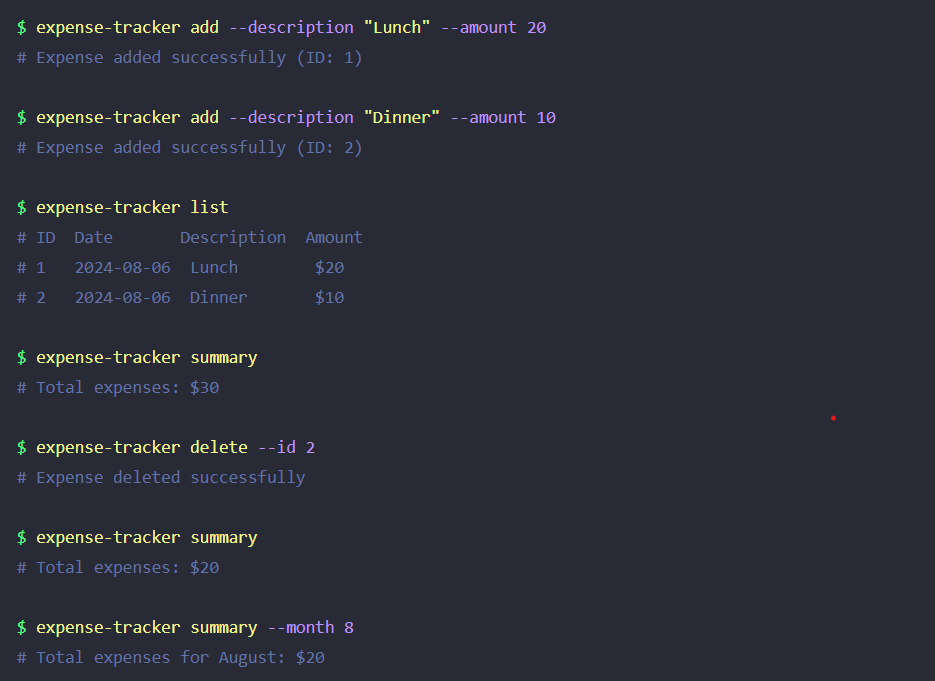

# Expense Tracker CLI - PHP Application


This is a simple command-line interface (CLI) application written in PHP for expense tracking. It allows users to create, view, update, and delete expenses, as well as manage their expense list using a local JSON file. This README provides detailed instructions on installation, configuration, and usage of the application, along with a complete overview of its functionalities.

Inspiration from: https://roadmap.sh/projects/expense-tracker

## Features

- **Add Expense**: Record new expenses with details like amount, category, and description.
- **View Expenses**: View a list of all recorded expenses.
- **Delete Expense**: Remove an expense from your list.
- **Filter by Month**: Filter expenses by the specified month.
- **Persistent Storage**: All data is saved in a local JSON file.
- **Sort Expenses**: Sort expenses by date or amount.
- **User-Friendly CLI**: Simple command-line interface for managing your expenses.


## The list of commands and their usage:


## Installation

1. Clone the repository to your local machine:

   ```bash
   git clone https://github.com/PawelKTech/expense-tracker-cli
   ```
2. Go to main folder: 
     ```bash
     cd expense-tracker-cli
     ```
3. Now u can easily manage your expenses $
   - Example
       ```bash
       php expense-tracker.php list
       ```